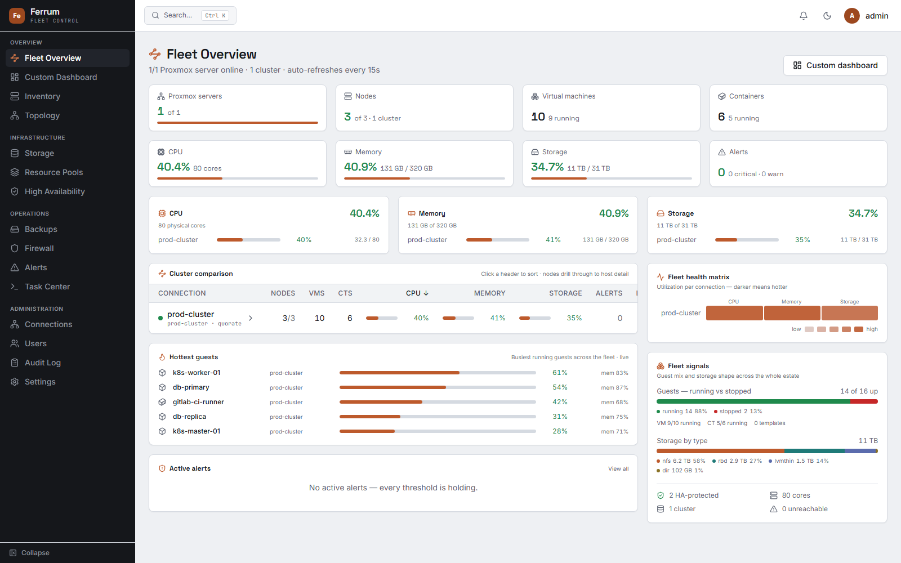
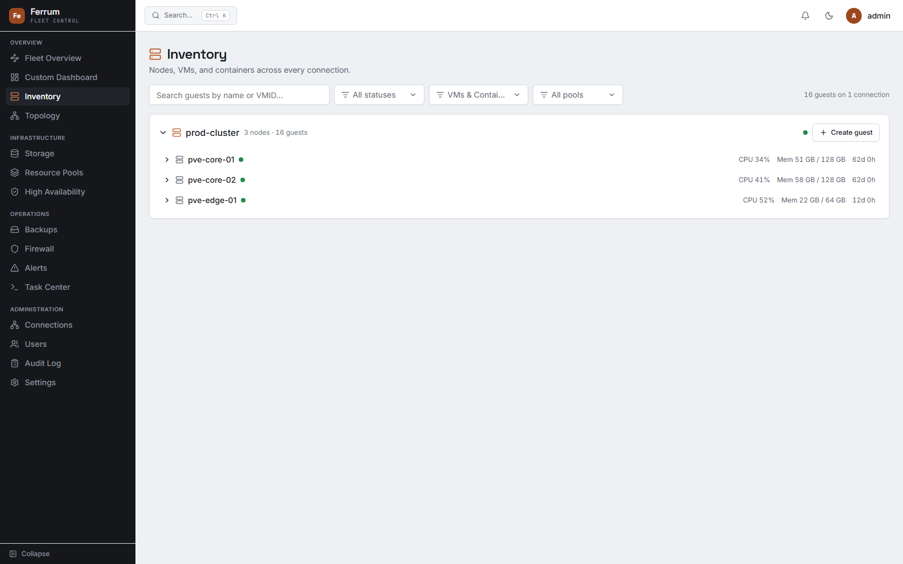
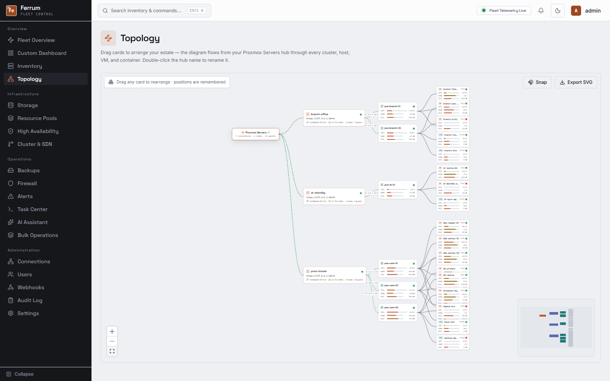
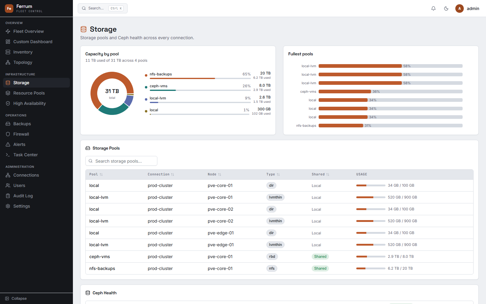
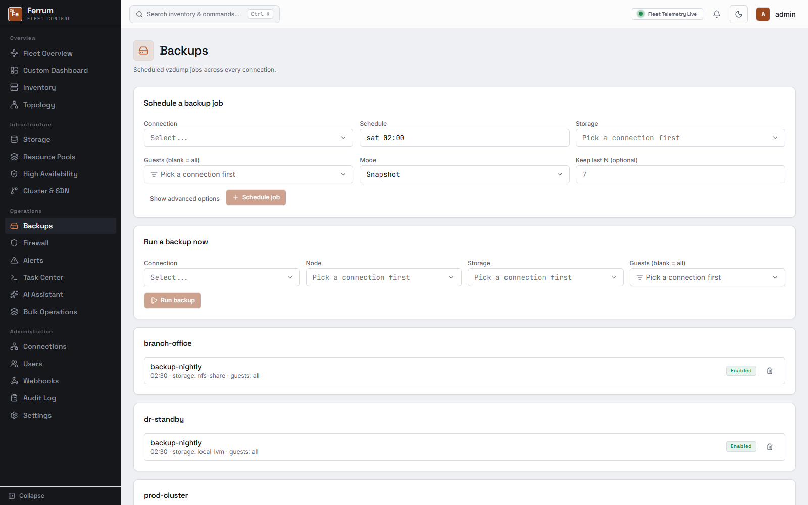
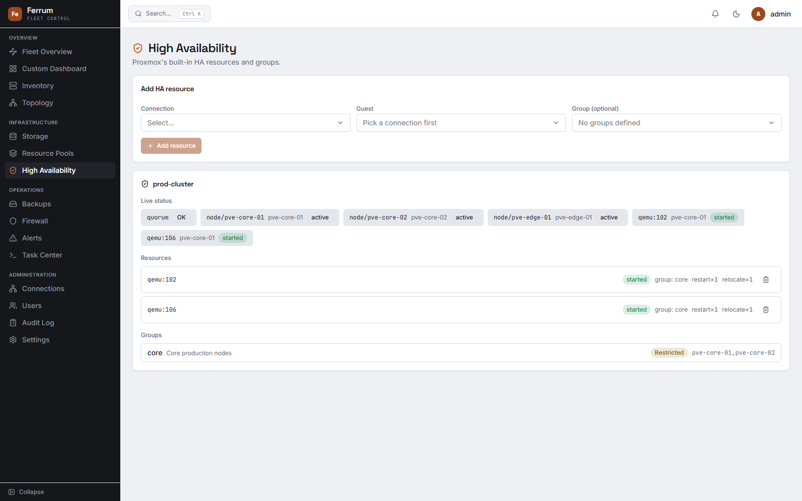
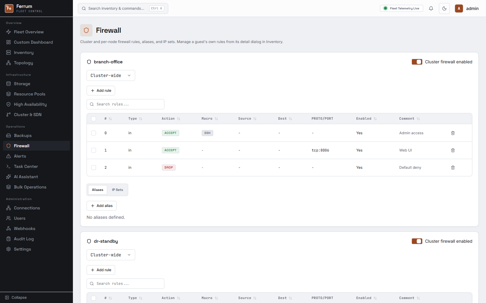
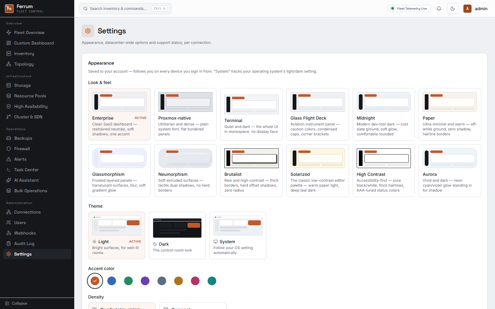
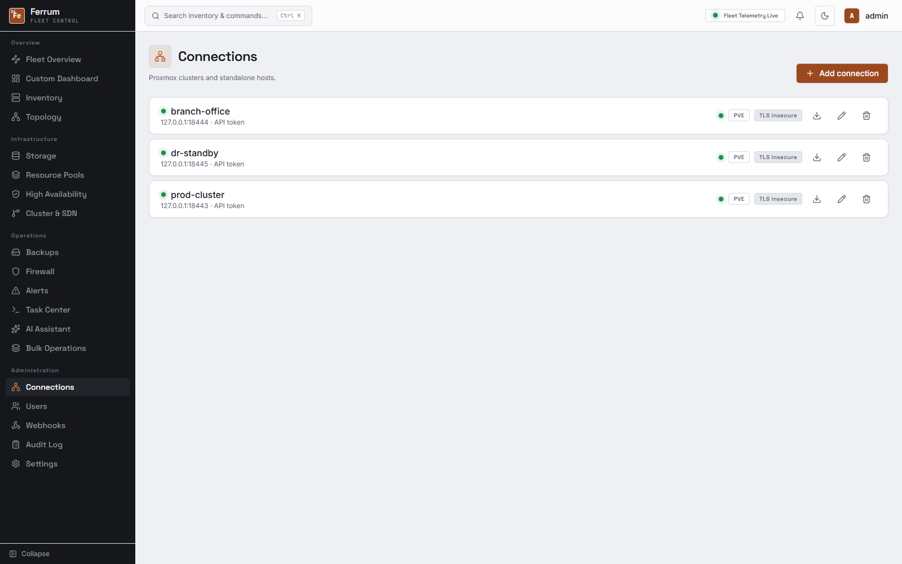
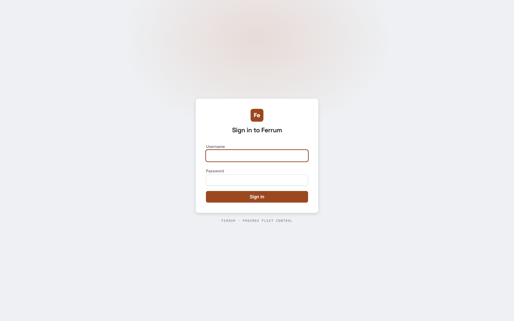

# Ferrum

Fleet control for Proxmox VE — a single dashboard for every cluster and standalone node you run, with live inventory, dashboards, backups, HA, firewall, alerting, and more.

- **Repository:** https://github.com/anand34577/ferrum
- **Backend:** Go (chi router), SQLite or PostgreSQL
- **Frontend:** React + TypeScript, Vite, Tailwind CSS v4

## Screenshots

Captured against a mock Proxmox cluster (`prod-cluster`: 3 nodes, 16 VMs/LXCs, Ceph + NFS storage) to show the UI populated the way it looks on a real fleet. Click any thumbnail for the full-size image.

<table>
<tr>
<td width="50%">
<a href="docs/screenshots/dashboard.png"></a>
<p align="center"><sub><b>Fleet overview</b></sub></p>
</td>
<td width="50%">
<a href="docs/screenshots/inventory.png"></a>
<p align="center"><sub><b>Inventory</b></sub></p>
</td>
</tr>
<tr>
<td width="50%">
<a href="docs/screenshots/topology.png"></a>
<p align="center"><sub><b>Topology</b></sub></p>
</td>
<td width="50%">
<a href="docs/screenshots/storage.png"></a>
<p align="center"><sub><b>Storage</b></sub></p>
</td>
</tr>
<tr>
<td width="50%">
<a href="docs/screenshots/backups.png"></a>
<p align="center"><sub><b>Backups & replication</b></sub></p>
</td>
<td width="50%">
<a href="docs/screenshots/high-availability.png"></a>
<p align="center"><sub><b>High availability</b></sub></p>
</td>
</tr>
<tr>
<td width="50%">
<a href="docs/screenshots/firewall.png"></a>
<p align="center"><sub><b>Firewall</b></sub></p>
</td>
<td width="50%">
<a href="docs/screenshots/settings-appearance.png"></a>
<p align="center"><sub><b>Look & feel</b> — Enterprise / Proxmox-native / Terminal</sub></p>
</td>
</tr>
<tr>
<td width="50%">
<a href="docs/screenshots/connections.png"></a>
<p align="center"><sub><b>Connections</b></sub></p>
</td>
<td width="50%">
<a href="docs/screenshots/setup.png"></a>
<p align="center"><sub><b>First-run setup</b></sub></p>
</td>
</tr>
</table>

## Getting started

```bash
go build ./cmd/ferrum
./ferrum -config config.example.yaml
```

The web UI is served from the same binary (see `web/embed.go`). For frontend development:

```bash
cd web
npm install
npm run dev
```

On first run, open the UI and create the initial admin account, then add a Proxmox connection (host, port, and either an API token or username/password) from **Connections**.

### Docker

```bash
docker build -t ferrum .
docker run -p 8080:8080 -v ferrum-data:/app/data ferrum
```

## Deploying a release build

Every [GitHub release](https://github.com/anand34577/ferrum/releases) ships prebuilt, statically-linked archives for Linux (amd64/arm64), Windows (amd64/arm64), and macOS (amd64/arm64) — no Go toolchain or CGO dependencies needed on the target machine. Each archive bundles the binary, `config.example.yaml`, and the install script for its OS.

### Linux (systemd)

One-liner, same idea as `get.docker.com` — downloads the latest release for your architecture, verifies its checksum, and installs it as a systemd service:

```bash
curl -fsSL https://raw.githubusercontent.com/anand34577/ferrum/main/scripts/get.sh | sudo sh
```

Pin a specific version with `FERRUM_VERSION`:

```bash
curl -fsSL https://raw.githubusercontent.com/anand34577/ferrum/main/scripts/get.sh | FERRUM_VERSION=v1.2.3 sudo sh
```

Or do it by hand from a downloaded archive — `scripts/get.sh` just automates these same steps:

```bash
tar -xzf ferrum_*_linux_amd64.tar.gz
cd ferrum_*_linux_amd64
sudo ./install.sh
```

Either way, this creates a dedicated `ferrum` system user, installs the binary to `/usr/local/bin/ferrum`, seeds `/etc/ferrum/config.yaml`, and enables + starts the `ferrum.service` systemd unit (`packaging/systemd/ferrum.service`) — data lives in `/var/lib/ferrum`, logs go to `journalctl -u ferrum -f`.

To uninstall, grab [`scripts/linux/uninstall.sh`](scripts/linux/uninstall.sh) and run it as root — add `-- --purge` to also remove config/data:

```bash
curl -fsSL https://raw.githubusercontent.com/anand34577/ferrum/main/scripts/linux/uninstall.sh | sudo bash -s --
```

### Windows (Windows Service)

```powershell
Expand-Archive ferrum_*_windows_amd64.zip
cd ferrum_*_windows_amd64
.\install-service.ps1   # run as Administrator
```

This installs the binary to `%ProgramFiles%\Ferrum`, seeds `%ProgramData%\Ferrum\config.yaml`, and registers a "Ferrum" Windows service — `ferrum.exe` detects it's running under the Service Control Manager and manages its own start/stop lifecycle, no wrapper (NSSM etc.) needed. Since Windows services don't capture stdout/stderr the way systemd does, logs are written to `%ProgramData%\Ferrum\ferrum.log`. Uninstall with `.\uninstall-service.ps1` (add `-Purge` to also remove config/data).

### Building from source

```bash
scripts/build.sh                       # current platform only, output in dist/
scripts/build.sh linux/amd64 windows/amd64
scripts/build.sh all                   # every platform the release workflow builds
```

```powershell
.\scripts\build.ps1                    # Windows-native equivalent, current platform only
```

Both build the frontend, cross-compile with version info baked in (`ferrum -version`), and package each target as a `.tar.gz`/`.zip` with its install script — the same thing [`.github/workflows/release.yml`](.github/workflows/release.yml) runs when a `vX.Y.Z` tag is pushed, publishing the resulting archives (and a `checksums.txt`) as GitHub Release assets.

## Configuration

Copy `config.example.yaml` to `config.yaml` and adjust as needed, or set the equivalent `FERRUM_*` environment variables (see the comments in that file for the full list, including SQLite/PostgreSQL, TLS cookie behavior, reverse-proxy support, and optional OIDC single sign-on).

Everything else — notifications, SSO details, security policy, system settings, AI providers, and the REST API/MCP enable switches below — is configured from the admin **Settings** UI once Ferrum is running, not from environment variables.

### Built-in LLM (Needle 2)

The AI Assistant and MCP tool-calling loop can use any OpenAI-chat-completions-compatible provider (OpenAI, Ollama, LM Studio, LocalAI, OpenRouter, ...) configured under **Settings > AI Providers**. There's also an optional zero-config, no-API-key, fully local option backed by [Needle 2](https://huggingface.co/Cactus-Compute/needle2) — a small (45M-parameter) tool-calling model that runs as a self-contained CLI binary with no GPU and no network access required at inference time.

Needle 2 is Apache-2.0 licensed, so on **Windows, Linux, and macOS (amd64 or arm64)** Ferrum ships its official CLI binary baked into the `ferrum` binary itself (`internal/needle/bundled_*.go`, one per platform via `go:embed`) — nothing to download, nothing to configure. On a fresh install (no AI provider configured yet), Ferrum extracts it to a cache file and registers it automatically as the default assistant the first time it starts — no manual "Add provider" step needed. If you've already configured a provider, or want to add/re-add it yourself, use **Settings > AI Providers** > "Add provider" > the **Needle 2 (built-in, local)** preset.

On any other platform (32-bit, RISC-V, Windows/ARM64, ...) there's no bundled binary — Ferrum still never fetches executable content from the network on its own. To enable it there:

1. Download the `needle` CLI binary for your platform from the [Needle 2 files](https://huggingface.co/Cactus-Compute/needle2/tree/main).
2. Point Ferrum at it: set `FERRUM_NEEDLE_BIN=/path/to/needle` (or `needleBinPath` in `config.yaml`) before starting Ferrum. This also overrides the bundled binary on a supported platform, if you'd rather run a different build.

Ferrum starts the binary itself (as a local subprocess, `127.0.0.1`-only) the first time it's used, and stops it on shutdown. If no binary is bundled for the platform and `FERRUM_NEEDLE_BIN` isn't set (or doesn't exist), this provider simply isn't usable — every other provider is unaffected.

## API access, MCP, and audit logging

Any user can generate long-lived API keys under **Profile > API Keys** — scoped to either the general REST API (`Authorization: Bearer <key>` against `/api/v1/...`, for 3rd-party integrations and scripts) or the MCP endpoint only (`/mcp`, for Claude Code/Desktop or any other MCP-capable agent — see **Profile > MCP integration** for ready-to-paste config). Both surfaces are off by default and must be turned on by an admin under **Settings > API & MCP**, which also caps how many tool calls the AI Assistant's agent loop can make per message. Every mutating action — through the UI, the REST API, or MCP — is recorded with who, what, and when under **Audit Log** (admin-only).

## License

[MIT](LICENSE)
