# Ferrum

<p align="center">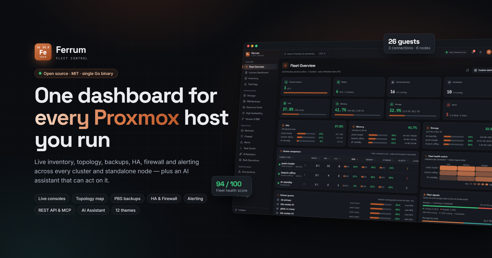</p>

Fleet control for Proxmox VE — a single dashboard for every cluster and standalone node you run, with live inventory, dashboards, backups, HA, firewall, alerting, and more.

- **Repository:** https://github.com/anand34577/ferrum
- **Website & docs:** https://anand34577.github.io/ferrum/ — includes a [live click-through demo](https://anand34577.github.io/ferrum/demo/)
- **Backend:** Go (chi router), SQLite or PostgreSQL
- **Frontend:** React + TypeScript, Vite, Tailwind CSS v4

## Features

- **Fleet-wide overview** — every connection (PVE cluster, standalone node, or PBS remote) rolled up into one dashboard: node/guest counts, CPU/memory/storage, active alerts, and a drag-and-drop customizable dashboard with 20+ widgets.
- **Inventory & operations** — nodes, VMs, and LXCs with live consoles/shells (noVNC + xterm.js), snapshots, guest agent file browser, bulk start/stop/migrate, and cross-cluster guest migration.
- **Storage & backups** — pool usage and Ceph health across every connection, backup job status and replication, and PBS remote integration alongside native PVE storage.
- **High availability, firewall & SDN** — HA groups/resources, cluster and per-node firewall rules, and SDN zones/VNets/subnets, all per connection.
- **Alerting & automation** — threshold-based alerts (CPU/memory/disk/guest), config drift detection, guest lifecycle policies, capacity forecasting, a fleet health score, scheduled health-digest emails, and Terraform/Ansible inventory export.
- **Integrations** — outbound webhooks for real-time events, a REST API and MCP server (scoped API keys, so any MCP-capable agent or script can drive Ferrum), and a built-in AI Assistant that can use any OpenAI-compatible provider.
- **Access & auditing** — user management with role labels (effective access control is admin vs non-admin), optional OIDC single sign-on, session/certificate monitoring, and a full audit log of every mutating action across the UI, REST API, and MCP.
- **A dozen look-and-feel presets** — Enterprise, Proxmox-native, Terminal, Glass Flight Deck, Midnight, Paper, Glassmorphism, Neumorphism, Brutalist, Solarized, High Contrast, and Aurora — each with light/dark and a choice of accent colors.

## Screenshots

A populated fleet — 3 connections, 6 nodes, 26 VMs/LXCs across two clusters and a standalone host, with Ceph and NFS storage. Click any thumbnail for the full-size image.

<p align="center"><a href="docs/screenshots/dark-light.png">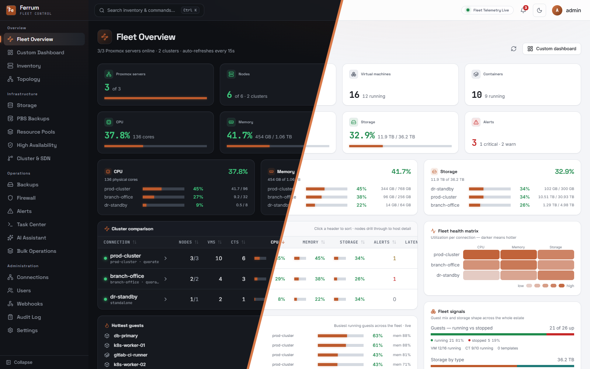</a><br><sub><b>Dark &amp; light</b> — every look ships both, with your choice of accent color</sub></p>

<table>
<tr>
<td width="50%">
<a href="docs/screenshots/dashboard.png">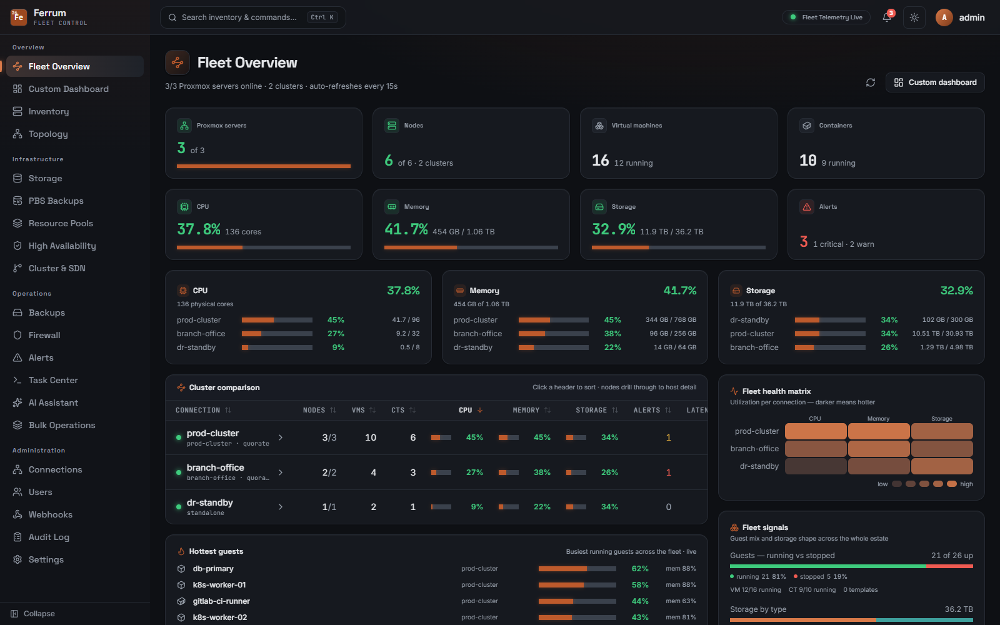</a>
<p align="center"><sub><b>Fleet overview</b></sub></p>
</td>
<td width="50%">
<a href="docs/screenshots/custom-dashboard.png">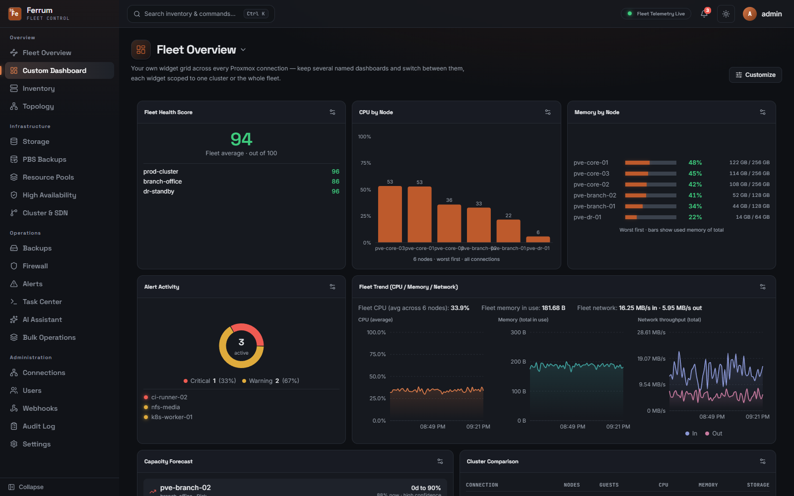</a>
<p align="center"><sub><b>Custom dashboards — drag-and-drop widgets</b></sub></p>
</td>
</tr>
<tr>
<td width="50%">
<a href="docs/screenshots/inventory.png">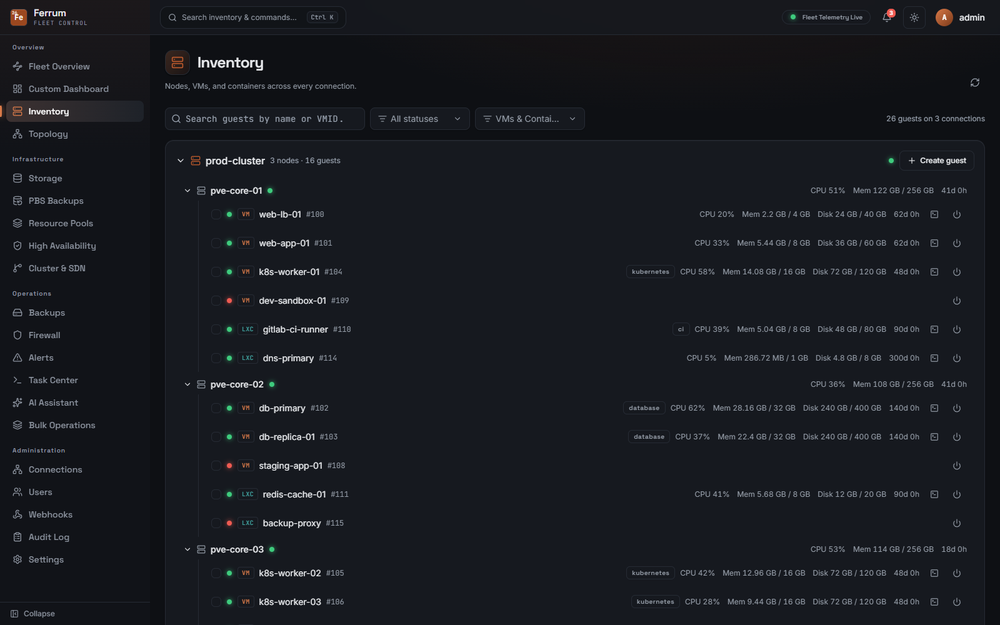</a>
<p align="center"><sub><b>Inventory — nodes, VMs & LXCs</b></sub></p>
</td>
<td width="50%">
<a href="docs/screenshots/topology.png">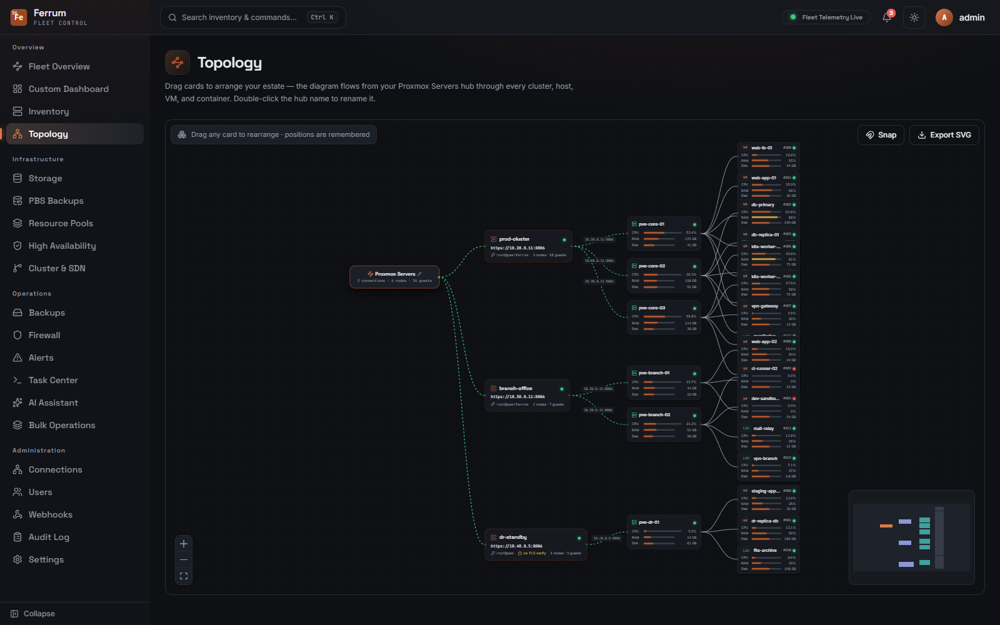</a>
<p align="center"><sub><b>Topology map</b></sub></p>
</td>
</tr>
<tr>
<td width="50%">
<a href="docs/screenshots/ai-assistant.png">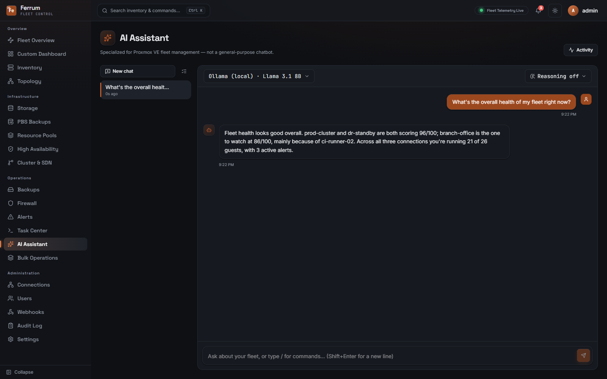</a>
<p align="center"><sub><b>AI Assistant — any OpenAI-compatible provider</b></sub></p>
</td>
<td width="50%">
<a href="docs/screenshots/alerts.png">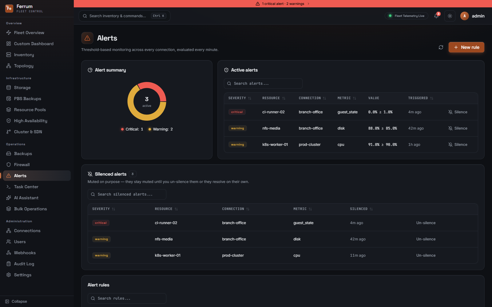</a>
<p align="center"><sub><b>Alerting & silencing</b></sub></p>
</td>
</tr>
<tr>
<td width="50%">
<a href="docs/screenshots/storage.png">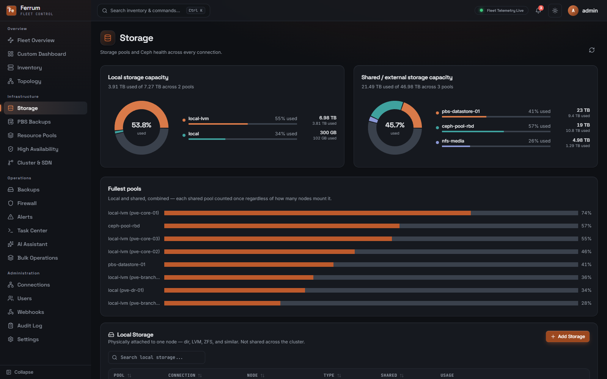</a>
<p align="center"><sub><b>Storage pools & Ceph</b></sub></p>
</td>
<td width="50%">
<a href="docs/screenshots/backups.png">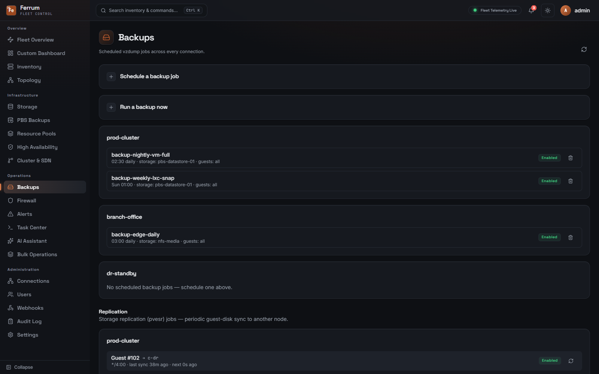</a>
<p align="center"><sub><b>Backups & replication</b></sub></p>
</td>
</tr>
<tr>
<td width="50%">
<a href="docs/screenshots/high-availability.png">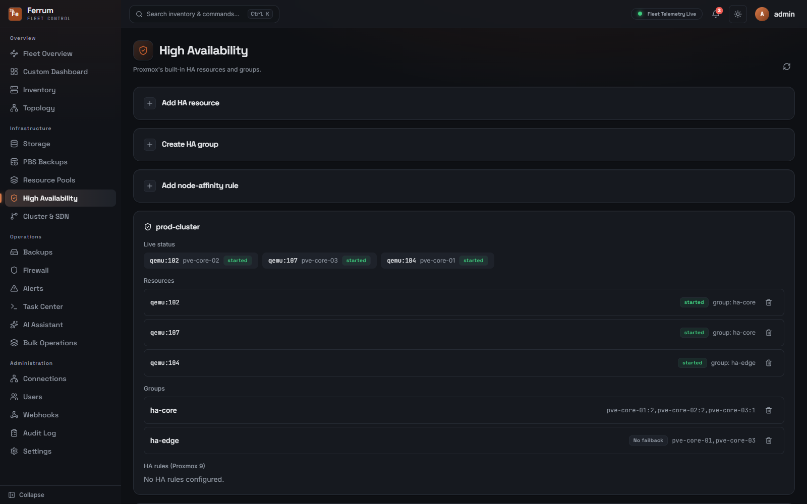</a>
<p align="center"><sub><b>High availability</b></sub></p>
</td>
<td width="50%">
<a href="docs/screenshots/firewall.png">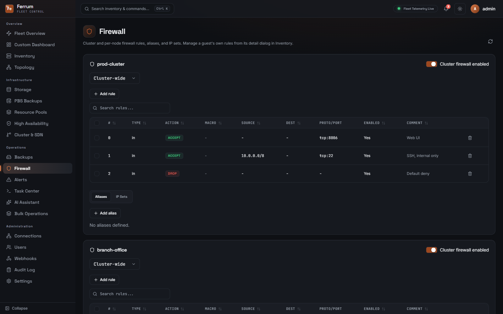</a>
<p align="center"><sub><b>Firewall</b></sub></p>
</td>
</tr>
<tr>
<td width="50%">
<a href="docs/screenshots/connections.png">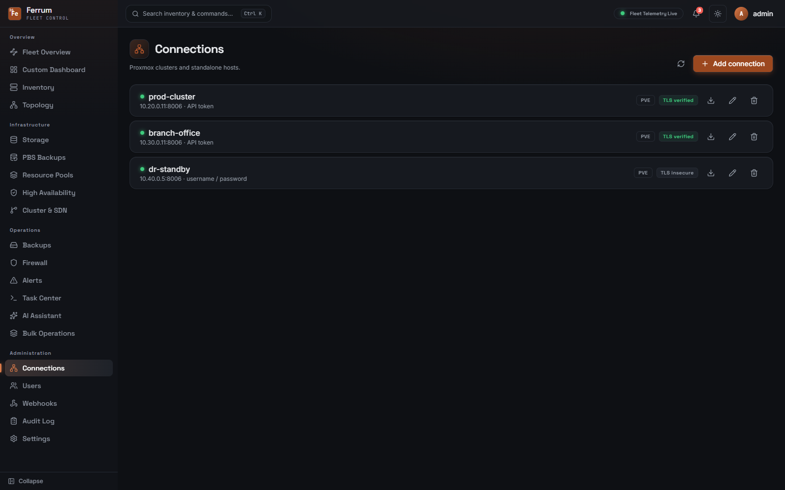</a>
<p align="center"><sub><b>Connections</b></sub></p>
</td>
<td width="50%">
<a href="docs/screenshots/settings-appearance.png">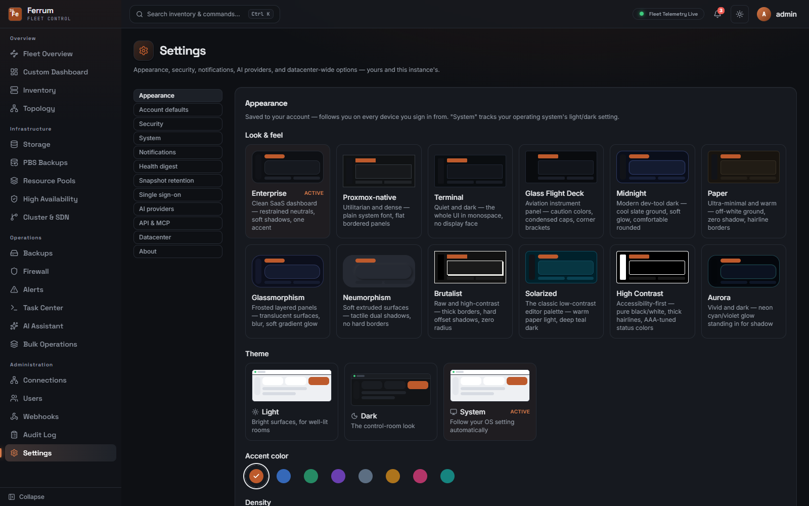</a>
<p align="center"><sub><b>12 look-and-feel presets</b></sub></p>
</td>
</tr>
</table>

## Getting started

The web UI is embedded in the binary (see `web/embed.go`), and `web/dist` is gitignored — so on a fresh clone the frontend must be built before the Go build, or `go:embed` will fail:

```bash
cd web
npm install
npm run build
cd ..
go build ./cmd/ferrum
./ferrum -config config.example.yaml
```

For frontend development:

```bash
cd web
npm install
npm run dev
```

On first run, open the UI and create the initial admin account, then add a Proxmox connection (host, port, and either an API token or username/password) from **Connections**.

### Docker

Prebuilt multi-arch (amd64/arm64) images are published to GHCR on every release:

```bash
docker run -p 8080:8080 -v ferrum-data:/app/data ghcr.io/anand34577/ferrum:latest
```

Or build locally from source:

```bash
docker build -t ferrum .
docker run -p 8080:8080 -v ferrum-data:/app/data ferrum
```

## Deploying a release build

Every [GitHub release](https://github.com/anand34577/ferrum/releases) ships prebuilt, statically-linked archives for Linux (amd64/arm64), Windows (amd64/arm64), and macOS (amd64/arm64) — no Go toolchain or CGO dependencies needed on the target machine. Each archive bundles the binary, `config.example.yaml`, and the install script for its OS.

### Linux (systemd)

One-liner, same idea as `get.docker.com` — downloads the latest release for your architecture, verifies its checksum, and installs it as a systemd service:

```bash
curl -fsSL https://raw.githubusercontent.com/anand34577/ferrum/main/scripts/get.sh | sudo sh
```

Pin a specific version with `FERRUM_VERSION`:

```bash
curl -fsSL https://raw.githubusercontent.com/anand34577/ferrum/main/scripts/get.sh | FERRUM_VERSION=v1.2.3 sudo sh
```

Or do it by hand from a downloaded archive — `scripts/get.sh` just automates these same steps:

```bash
tar -xzf ferrum_*_linux_amd64.tar.gz
cd ferrum_*_linux_amd64
sudo ./install.sh
```

Either way, this creates a dedicated `ferrum` system user, installs the binary to `/usr/local/bin/ferrum`, seeds `/etc/ferrum/config.yaml`, and enables + starts the `ferrum.service` systemd unit (`packaging/systemd/ferrum.service`) — data lives in `/var/lib/ferrum`, logs go to `journalctl -u ferrum -f`.

To uninstall, grab [`scripts/linux/uninstall.sh`](scripts/linux/uninstall.sh) and run it as root — add `-- --purge` to also remove config/data:

```bash
curl -fsSL https://raw.githubusercontent.com/anand34577/ferrum/main/scripts/linux/uninstall.sh | sudo bash -s --
```

### Windows (Windows Service)

```powershell
Expand-Archive ferrum_*_windows_amd64.zip
cd ferrum_*_windows_amd64
.\install-service.ps1   # run as Administrator
```

This installs the binary to `%ProgramFiles%\Ferrum`, seeds `%ProgramData%\Ferrum\config.yaml`, and registers a "Ferrum" Windows service — `ferrum.exe` detects it's running under the Service Control Manager and manages its own start/stop lifecycle, no wrapper (NSSM etc.) needed. Since Windows services don't capture stdout/stderr the way systemd does, logs are written to `%ProgramData%\Ferrum\ferrum.log`. Uninstall with `.\uninstall-service.ps1` (add `-Purge` to also remove config/data).

### Building from source

```bash
scripts/build.sh                       # current platform only, output in dist/
scripts/build.sh linux/amd64 windows/amd64
scripts/build.sh all                   # every platform the release workflow builds
```

```powershell
.\scripts\build.ps1                    # Windows-native equivalent, current platform only
```

Both build the frontend, cross-compile with version info baked in (`ferrum -version`), and package each target as a `.tar.gz`/`.zip` with its install script — the same thing [`.github/workflows/release.yml`](.github/workflows/release.yml) runs when a `vX.Y.Z` tag is pushed, publishing the resulting archives (and a `checksums.txt`) as GitHub Release assets.

## Configuration

Copy `config.example.yaml` to `config.yaml` and adjust as needed, or set the equivalent `FERRUM_*` environment variables (see the comments in that file for the full list, including SQLite/PostgreSQL, TLS cookie behavior, reverse-proxy support, and optional OIDC single sign-on).

Everything else — notifications, SSO details, security policy, system settings, AI providers, and the REST API/MCP enable switches below — is configured from the admin **Settings** UI once Ferrum is running, not from environment variables.

### AI Assistant providers

The AI Assistant and MCP tool-calling loop use any OpenAI-chat-completions-compatible provider (OpenAI, Ollama, LM Studio, LocalAI, OpenRouter, ...) configured under **Settings > AI Providers**. For a fully local setup, run Ollama or LM Studio and pick its preset.

## API access, MCP, and audit logging

Any user can generate long-lived API keys under **Profile > API Keys** — scoped to either the general REST API (`Authorization: Bearer <key>` against `/api/v1/...`, for 3rd-party integrations and scripts) or the MCP endpoint only (`/mcp`, for Claude Code/Desktop or any other MCP-capable agent — see **Profile > MCP integration** for ready-to-paste config). Both surfaces are off by default and must be turned on by an admin under **Settings > API & MCP**, which also caps how many tool calls the AI Assistant's agent loop can make per message. Every mutating action — through the UI, the REST API, or MCP — is recorded with who, what, and when under **Audit Log** (admin-only).

## License

[MIT](LICENSE)
